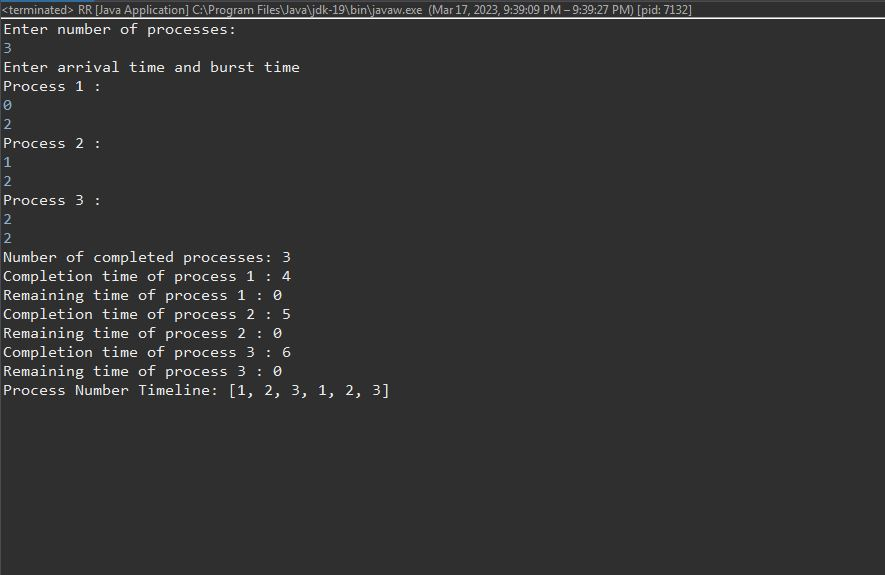
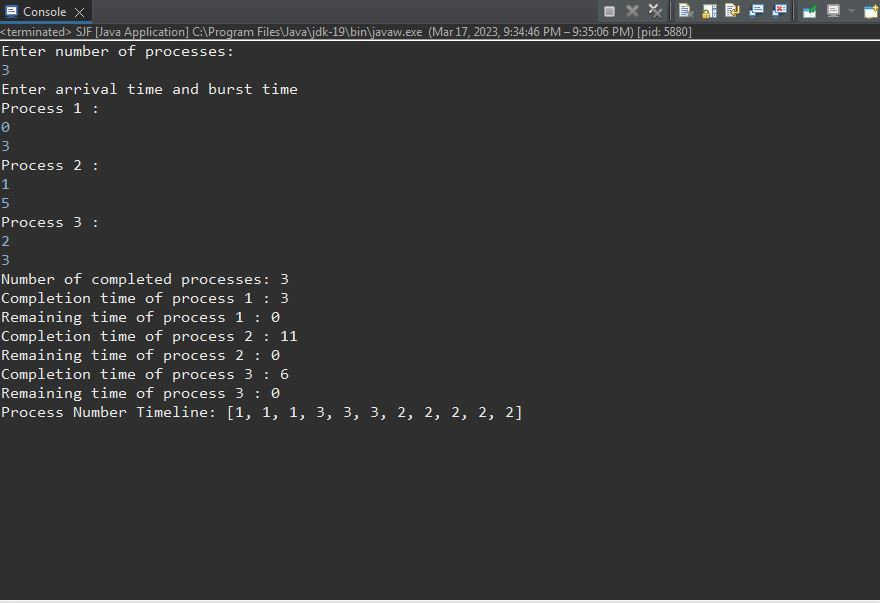

# OS_Lab
This project contains Java implementations of two CPU scheduling algorithms: Round Robin (RR) and Shortest-Job-First (SJF).

## RR Algorithm
The round-robin algorihtm generally uses time-sharing, giving each job a time slot or quantum, in this program we use each loop as the time slot, same for the SJF. The implementation of the RR algorithm can be found in the <a href="https://github.com/trytogitme/OS_Lab/blob/main/">RR.java</a> file. The program reads in the processes and outputs the remaining time, completion time and timeline for the processes.

## SJF Algorithm
The SJF algorithm is a non-preemptive scheduling version of the SRTF algorithm that schedules processes ascendingly based on the burst time of each process. The implementation of the SJF algorithm can be found in the <a href="https://github.com/trytogitme/OS_Lab/blob/main/">SJF.java</a> file. The program reads in the processes and outputs the remaining time, completion time and timeline for the processes.

